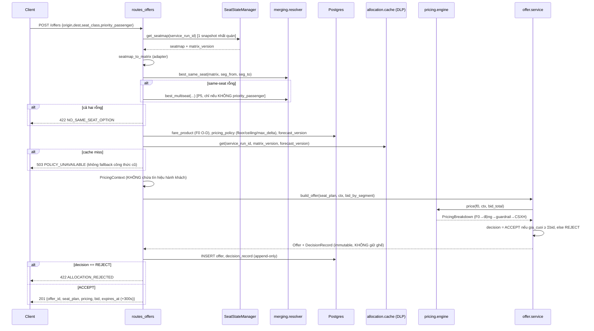
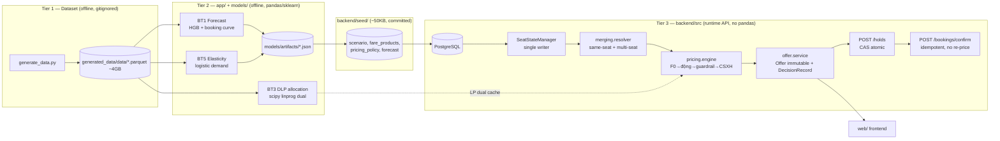

# Âu Lạc Railway — Luồng chạy, Logic, Thuật toán, Business

Tài liệu tổng hợp toàn bộ pipeline runtime + thuật toán offline của dự án. Nguồn: đọc trực
tiếp code `backend/src/`, `app/`, đối chiếu `NOTE_DEV.md`, `CLAUDE.md` (2026-07-18).

## 1. Ba tầng, KHÔNG được lẫn

```
generated_data/  (dataset 12 tháng, ~4GB, gitignored)
        │  hiệu chuẩn OFFLINE (không đụng runtime)
        ▼
app/ + models/ + eval/  (tier 2 — 5-subproblem BT1..BT5, cần pandas/sklearn)
        │  export số liệu → seed JSON (~50KB, commit git)
        ▼
backend/seed/  →  PostgreSQL  →  backend/src/ (API v1, tier 3 runtime)  →  web/
```

**Bất biến tối thượng:** dataset KHÔNG BAO GIỜ nối trực tiếp runtime. `backend/src/` không
`import pandas`. Tier 2 chỉ hiệu chuẩn con số nạp vào `backend/seed/`; `_ground_truth/` là
poison — chỉ `eval/`/backtest tier-2 được đọc, `grep -r "_ground_truth" backend/src/` phải rỗng.

Tier 2 (`app/`) và tier 3 (`backend/`) build **độc lập rồi khớp nối** — quy ước index khác
nhau (0-based nửa mở `[a,b)` ở `app/bt2_ssm.py` vs 1-based inclusive `[from,to]` ở
`backend/`), khớp qua `backend/src/adapters/model_adapter.py` + `integration/`.

## 2. Golden scenario (hằng số dùng khắp nơi)

- `service_run_id = SE1_2026-06-15_LE`, service date 2026-06-15, chế độ giá AI.
- 8 ga / 7 leg, `segment_id ∈ {1..7}` 1-based. `seat_plan` dùng `[segment_from, segment_to]`
  **inclusive**.
- 40 ghế lớp `NGOI_MEM_DH`, `seat_id = C{car}-S{seat}` → `C01-S001..C01-S040`.
- **Golden gap:** `C01-S017` bán L1-L2, TRỐNG L3-L4 (THO→DHO), bán L5-L7. Request THO→DHO
  là cái baseline (FCFS không tái dùng gap) từ chối, Âu Lạc bán được trên đúng 1 ghế.

## 3. Luồng `POST /offers` — pipeline lõi

File: `backend/src/api/routes_offers.py::create_offer`.



**Thứ tự cố định, không đảo (Master §8):** snapshot nhất quán → resolver same-seat →
resolver multi-seat (fallback) → base fare O-D → bid DLP → PricingContext hợp pháp →
PricingEngine (động → guardrail → CSXH cuối) → so `gia_cuoi_vnd` vs `Σbid` → Offer immutable +
DecisionRecord. Offer KHÔNG giữ ghế — giữ ghế là việc riêng của `/holds`.

## 4. Thuật toán resolver (ghép chặng) — `merging/resolver.py`

### 4.1 Same-seat liên tục (chặng chính)
```
continuous_same_seat(matrix, seg_from, seg_to):
    free = (matrix[:, seg_from-1 : seg_to] == FREE).all(axis=1)   # numpy 1 dòng
    return flatnonzero(free)
```
- `matrix` shape `(40 seats, 7 segments)`, giá trị `FREE=0 / SOLD=1 / HELD=2`.
- **Ranking best-fit:** ghế có ít ô FREE thừa NGOÀI span nhất đứng trước (nhét khách vào
  khoảng trống khít nhất — golden gap = 0 ô thừa). `reused_gap`-first là hệ quả tự nhiên
  (ghế reused luôn ít ô thừa hơn ghế trống hoàn toàn). Tie-break theo `seat_id` (tất định).
- `reused_gap = True` nếu ghế có booking SOLD trước `seg_from` hoặc sau `seg_to`.
- `priority_passenger=True` → chỉ nhận option same-seat (không bao giờ đổi ghế); ở MVP mọi
  option same-seat đã thoả nên filter là no-op nhưng giữ để invariant hiện rõ trong code.
- KHÔNG BAO GIỜ di chuyển vé đã SOLD.

### 4.2 Ghép nhiều ghế (fallback khi same-seat rỗng) — P5
Greedy min-interval cover: phủ `[seg_from, seg_to]` bằng ít ghế nhất, tìm ghế FREE dài nhất
tại mỗi vị trí, đặt điểm đổi ghế càng xa càng tốt nhưng **cấm đặt tại ga có dwell < 5 phút**
(tránh khách không kịp đổi toa). Nếu không phủ hết hoặc chỉ cần 1 ghế → trả `None` (đã có
same-seat lo rồi).
- `priority_passenger=True` → luôn trả `[]` (không bao giờ bị đổi ghế — YC4).
- Kết quả `MergedSeatPlan`: nhiều `SeatLeg`, `change_station_ids`, `so_lan_doi_cho = legs-1`,
  `requires_seat_change=True`, `requires_customer_consent=True` — **bắt buộc khách xác nhận**
  ở `/holds` trước khi giữ ghế (`ConsentRequired` nếu thiếu `consent`).

## 5. Thuật toán bid price (chi phí cơ hội mỗi đoạn)

Hai bản, dùng ở hai nơi khác nhau — **không được nhầm lẫn**:

| | Vị trí dùng | Phương pháp |
|---|---|---|
| **DLP bid price (LP dual)** | `/offers` sống (qua `allocation/cache.py` → `app.bt3_allocation.analyze_run`) | Giải LP thật: `max Σ f·y  s.t. A y ≤ chỗ_còn_lại, 0 ≤ y ≤ D_còn_lại` (scipy `linprog`, HiGHS). `bid_price = -dual của ràng buộc sức chứa` (chi phí cơ hội biên 1 chỗ/đoạn). Giải 1 lần/version, **cache theo `(service_run_id, matrix_version, forecast_version)`**, KHÔNG giải lại mỗi request (giữ p95 < 1s). LP fail → cache rỗng → route trả 503, KHÔNG fallback công thức cũ. |
| **Scarcity formula (xấp xỉ đóng)** | Chỉ `backend/src/backtest/engine.py` replay ~2000 event/backtest | `pressure = forecast_remaining / remaining_capacity`; `scarcity = clip((pressure-0.5)/(0.9-0.5), 0, 1)`; `bid = round_1k(1.152.000/1726km × distance_km × scarcity)`. Hằng số neo từ giá thật SE1 HNO-SGO. **KHÔNG được gọi là EMSR-b.** |

Gọi sai tên (vd "EMSR-b") cho route `/offers` là sai — đó là DLP dual thật.

## 6. Thuật toán forecast (BT1, `forecast/forecast.py`)

```
sold_at_seed[s]      = 40 − remaining_capacity_seed[s]
total_seed[s]        = sold_at_seed[s] + forecast_remaining_demand_seed[s]   # anchor cố định
F(band, is_tet, u)   = booking curve THẬT (models/artifacts/bt1_booking_curves.json)
total_pickup[s]      = sold[s] / F(band_s, tet, days_to_departure)
total[s]             = 0.5·total_seed[s] + 0.5·total_pickup[s]               # BLEND_W=0.5
forecast_remaining[s] = max(total[s] − sold[s], 0)
confidence[s]         = 0.5 + 0.5·F
```
`refresh_forecast` bump `forecast_version +1`, giữ nguyên `service_run_id`/`che_do_gia` của
bản trước nếu không override — một offer luôn dùng đúng một bộ version. Ghi log
`divergence = (sold − expected)/expected` mỗi refresh (tín hiệu bán nhanh/chậm hơn kỳ vọng).

Cơ chế update port từ `app.bt1_forecast.DemandModel` (model HGB thật train trên
22 ga/448 chỗ) — nhưng số tuyệt đối golden (8 ga/40 chỗ) vẫn neo vào seed đã hiệu chuẩn, model
chỉ cấp *cơ chế* pickup/divergence, không cấp số tuyệt đối (khác grain).

## 7. Thuật toán định giá (BT5, `pricing/engine.py`)

**Thứ tự cố định, KHÔNG đảo:**

```
1. F0 (giá gốc O-D, tra bảng, KHÔNG cộng leg)
2. Đề xuất giá động:
   a. δ mùa vụ THẬT (bt5_pricing_params.json, DGP thật): Tết ưu tiên hơn hè
      price_raw = F0 · (1 + δ_mua)
   b. NẾU elasticity đã nạp (app.elasticity.Elasticity):
      trần   r_ceil  = 1 + elastic_markup_max · LF_max
      sàn    r_floor = 1 − elastic_markdown_max · (1 − LF_max)
      (Tết: nới trần theo δ_mua, sàn ≥ 1+δ_mua)
      optimal_price = argmax_r  P(mua | r,d_km,tet,lead_time) · (r·F0 − c_opportunity)
                       trên lưới r ∈ [floor,ceil], c = Σbid DLP hành trình
      → grid search 40 điểm, KHÔNG suy đoán khi elasticity=None (fallback mùa-vụ-only)
3. Guardrail (policy PHẢI approved, thiếu → 503 PolicyUnavailableError, KHÔNG default giá):
   - clip [F0·floor_ratio, F0·ceiling_ratio]  → chạm "SAN"/"TRAN"
   - max_delta so với giá trước (nếu có)      → chạm "MAX_DELTA"
   - round_to_1k
   - policy.frozen=True → trả thẳng round_to_1k(F0), bỏ qua guardrail khác → "FREEZE"
4. CSXH — ÁP SAU CÙNG, MAX một mức (KHÔNG cộng dồn), nhân (1-muc_giam), round_to_1k
   — Điều 40 NĐ 16/2026, dựa trên giá gia_niem_yet đã qua guardrail
5. decision = ACCEPT nếu gia_cuoi_vnd ≥ Σ bid_by_segment, else REJECT
```

Tiền `int64` đồng, `round_to_1k` ở MỌI điểm ra. `PricingContext` bị `__post_init__` chặn cứng
nếu chứa bất kỳ field nào trong `FORBIDDEN_PRICING_FEATURES` (user_id, số lần tìm kiếm, thiết
bị, IP, giới tính, tuổi, lịch sử mua...) — tách biệt hoàn toàn khỏi `SafetyContext` (đối
tượng ưu tiên/CSXH), enforce bằng type + assertion, không phải bằng convention.

## 8. State machine ghế — `state/seat_state_manager.py`

`SeatStateManager` là **single writer duy nhất** cho `seat_segment_state` +
`service_run.matrix_version`. `FREE(0) → HELD(2) → SOLD(1)`, hoặc `HELD → EXPIRED` (TTL 600s).

### 8.1 `hold_multi` — CAS atomic, tất-cả-hoặc-không
```
expire_due_holds() trước
idempotency_key đã tồn tại → trả kết quả cũ (idempotent)
BEGIN
  SELECT matrix_version FROM service_run FOR UPDATE
  expected_matrix_version ≠ current → ROLLBACK, raise StaleSnapshot
  Pha 1: với MỌI leg (sort theo seat_id — deadlock guard):
      SELECT ... FOR UPDATE các cell; verify TOÀN BỘ đang FREE
      1 leg không sạch → ROLLBACK toàn bộ, raise SeatConflict
  Pha 2: mọi leg sạch → UPDATE tất cả cell → HELD, dùng CHUNG 1 hold_id
  matrix_version += 1
COMMIT
```
Postgres lo atomicity (không tự viết lock/Redis/retry loop). ≥2 leg (ghép nhiều ghế) vẫn
1 transaction duy nhất cho mọi cell của mọi ghế.

### 8.2 `confirm` — idempotent HELD→SOLD, KHÔNG tính lại giá
Booking đã tồn tại (theo `hold_id`) → trả lại y hệt kết quả cũ. Hold không tồn tại/hết hạn →
`HoldExpired` (410). Hợp lệ → `UPDATE ... SOLD`, tạo `booking`, dùng đúng `final_price_vnd`
đã chốt lúc `/offers` (không re-price).

### 8.3 `reset_scenario` — all-or-nothing, checksum tất định
Xoá sạch state cũ (booking/hold/offer/seat_segment_state) → build lại 40×7 = 280 cell FREE →
replay `initial_bookings.jsonl` → nạp `fare_products`, `pricing_policy`, `forecast` từ seed.
Checksum = SHA256(scenario + bookings, sort_keys) — verify tất định giữa các lần reset.

## 9. Backtest — `backend/src/backtest/engine.py`

So sánh **Baseline B0** (hệ thống vé truyền thống) vs **Âu Lạc** trên cùng event stream
(common random numbers, ~400 request/seed × 5 seed committed).

- **Baseline B0** = "ghế trinh nguyên" — 1 ghế có BẤT KỲ booking nào coi như dùng hết, KHÔNG
  tái sử dụng gap. Mô hình hoá hệ thống vé không hỗ trợ bán lại đoạn trống giữa 2 vé cùng ghế.
  Bán giá niêm yết F0 cố định.
- **Âu Lạc** = `SegmentSeatMatrix.first_fit` (same-seat thật) + gate: chỉ nhận nếu
  `fare ≥ Σbid_segment` (bid = scarcity formula §5). Bán giá `PricingEngine` (v2 elasticity
  thật — cùng artifact với `/offers` sống).
- Metrics: `false_sold_out_rate` (baseline từ chối nhưng Âu Lạc nhận), `empty_seat_km`,
  `passenger_km`, revenue median/min/max mỗi bên qua 5 seed, checksum SHA256 tất định.
- `GET /backtests/{id}` trả `baseline_metrics` vs `ai_metrics` (field name theo openapi).

## 10. `/demo/*` — endpoint đọc + điều khiển vòng đời scenario

| Endpoint | Việc làm |
|---|---|
| `POST /demo/scenarios/{id}/reset` | `ssm.reset_scenario()` + `allocation_cache.refresh()` (giải DLP ngay, sẵn sàng cho `/offers` đầu tiên) |
| `POST /demo/forecasts/refresh` | Đếm sold/free hiện tại → `forecast.refresh_forecast` (bump version) → ghi DB → refresh lại DLP cache |
| `GET /demo/overview` | occupancy tổng, `total_revenue_vnd` (join booking→hold→offer, CONFIRMED only), `passenger_km`/`empty_seat_km`, `false_sold_out_rate` = REJECT/tổng decision, top-3 nghẽn/rỗng, 5 quyết định gần nhất |
| `GET /demo/seatmap` | Trạng thái từng ghế × từng đoạn, kèm `matrix_version` |
| `GET /demo/analytics` | Forecast + occupancy + bid price (đọc cache DLP, KHÔNG giải lại; cache miss → 0, không bịa fallback — endpoint chỉ đọc) mỗi đoạn |

## 11. Tier 2 — 5 subproblem offline (`app/`)

Không chạm runtime, hiệu chuẩn số cho `backend/seed/` + cấp bằng chứng backtest.

| Subproblem | File | Việc làm |
|---|---|---|
| BT1 — Forecast | `app/bt1_forecast.py` | `DemandModel`: HistGradientBoostingRegressor (train thật) + booking curve `F(u)` Poisson; MASE 0.50-0.52 |
| BT2 — Seat-state matrix | `app/bt2_ssm.py` | Ma trận ghế×đoạn int8 {0,1,2}, 0-based nửa mở `[a,b)` |
| BT3 — Allocation/DLP | `app/bt3_allocation.py` | `_solve_dlp`: LP mỗi lớp chỗ (`scipy.linprog`, HiGHS) → `y*` (phân bổ tối ưu) + `bid_price` (dual sức chứa = chi phí cơ hội biên) + `z_opt` |
| BT4 — Merging | `app/bt4_merge.py` (+ `integration/resolver_multiseat.py`) | Ghép chặng same-seat + ghép nhiều ghế offline reference |
| BT5 — Pricing | `app/bt5_pricing.py`, `app/elasticity.py` | `Elasticity.optimal_price`: `argmax_r P(mua|r)·(r·F0 − c)` trên lưới r, hệ số hồi quy `β_ln r = −1.19` (cầu KÉM co giãn — giảm sâu = lỗ doanh thu, đã kiểm bằng backtest) |

Contracts đóng băng giữa 5 subproblem: `app/contracts.py`
(`PassengerProfile, BookingRequest, SeatSegment, SeatOption, SegmentLoad, QuotaRow,
ForecastRow, Quote, WaitlistEntry, GroupPlan, ProposalLog`).

`run_all.py` chạy tuần tự cả 5 → `models/artifacts/run_all_outputs.json`.

## 12. Business rules / bất biến cứng (vi phạm rẻ, phát hiện trễ đắt)

1. **`_ground_truth/` là poison lúc runtime** — chỉ scoring/backtest tier-2 được đọc.
2. **CSXH áp SAU CÙNG, MAX không cộng dồn** — Điều 40 NĐ 16/2026, trên giá đã qua động+guardrail.
3. **Tiền int64 đồng, `round_to_1k` mọi điểm ra.** Không float.
4. **`PricingContext` không được thấy `SafetyContext`** — enforce bằng assertion, không convention.
5. **4 version (matrix/forecast/policy + service_run_id) đồng bộ trong 1 offer** — frontend
   không tự ghép quyết định từ nhiều response rời; backend trả quyết định đã hoàn chỉnh.
6. **Hành khách ưu tiên (priority_passenger) không bao giờ nhận phương án đổi ghế** —
   resolver tự lọc rỗng cho nhóm này ở cả same-seat lẫn multi-seat.
7. **Ghép nhiều ghế cần consent tường minh** trước khi giữ ghế (`/holds` chặn thiếu `consent`).
8. **Không fallback giá mặc định khi thiếu policy/cache DLP** — fail closed 503
   `POLICY_UNAVAILABLE`, không bao giờ bán giá đoán mò.
9. **Offer immutable, không giữ ghế** — giữ ghế (CAS) tách riêng ở `/holds`; confirm không
   bao giờ tính lại giá (dùng đúng giá đã hold).
10. **Dataset có 2 điểm lệch biên có chủ đích** (M8b Tết/year ratio, M9 tải Apr) — không "sửa".

## 13. Sơ đồ tổng — tra cứu nhanh



## Câu hỏi chưa rõ

- `backend/rules/*.yaml` chỉ có `policy_constraints.yaml` — docstring `pricing/engine.py`
  nhắc "rules YAML" nhưng implementation thực tế dùng `bt5_pricing_params.json` (δ mùa vụ) +
  `Elasticity.optimal_price` (grid search), không load rule YAML nào trong request path hiện
  tại. `integration/pricing_rules_elastic.yaml` (đề xuất NOTE_DEV §3.3) chưa thấy được cắm vào
  `backend/`. Không chắc rule-YAML engine cũ còn tồn tại ở nhánh nào khác.
